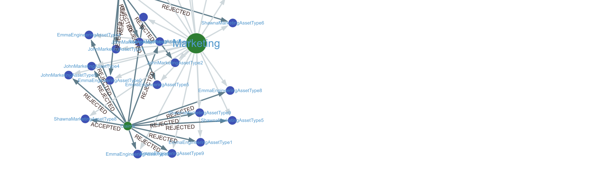

# Governance demos for DataZone

This project shows two examples of using generative AI to help with data governance.

## Visualization and query using graph

This section shows how to populate a graph database from the relationships in DataZone, and then use generative AI to query the graph database.

### Prerequisites

If you do not have an existing DataZone deployment, you can use this workshop to bootstrap a test environment.

* Deploy [first CFN stack](https://catalog.us-east-1.prod.workshops.aws/workshops/1bf9302a-862c-4e21-9e45-c81fa055643b/en-US/getting-started/self-paced/cloudformation)
* Deploy [second CFN stack](https://catalog.us-east-1.prod.workshops.aws/workshops/1bf9302a-862c-4e21-9e45-c81fa055643b/en-US/module-2-building-a-data-market-place/cfcustredacted)
* Follow this [guide](https://catalog.us-east-1.prod.workshops.aws/workshops/1bf9302a-862c-4e21-9e45-c81fa055643b/en-US/module-2-building-a-data-market-place/initial-setup-datazone-domains-creation) to create three sample projects. Don't worry about the IAM user configuration.

The script `scripts/data-generator.py` will generate synthetic information DataZone, including accepted and rejected requests for data assets. In this script, enter correct IDs for `domainId` on line 16, and `projects` on line 17. You can find these values in DataZone console after running the workshop stacks from the previous section.

Run the script to create several data assets and subscriptions.

*Do not run this script in a production DataZone environment*

### Populate and query graph

* Create a Neptune serverless cluster
* Create a Neptune notebook instance
* Upload and execute the notebook `datazone.ipynb`. This populates the graph and shows some GraphRAG examples.

### Visualize graph

Here are some visuals created in `gdotv`.

## Data catalog and inspection

This part will show how to use GenAI to help with data cataloging and inspection.

### Deployment

First, grant your CDK role permission to create databases in Lake Formation.

Next:

    cd inspector
    cdk deploy

Note the name of the S3 bucket created by this stack. You'll use it in the next section.

### Testing

You can use this [dataset](https://catalog.data.gov/dataset/center-for-medicare-medicaid-services-cms-medicare-claims-data) as a sample. Store it in the S3 bucket using the prefix `test/input.csv`. Then you can run the Step Function workflow. The first input to the workflow is the sample data; the others are pointers to where the workflow should write various outputs.

Sample SFN input:

    {
        "S3Input": "s3://inspectionstack-BUCKET-UNIQUE-ID/test/input.csv",
        "S3OutputFirst": "s3://inspectionstack-BUCKET-UNIQUE-ID/test/1/1.csv",
        "S3OutputSecond": "s3://inspectionstack-BUCKET-UNIQUE-ID/test/1/2.csv",
        "S3OutputSchema1": "s3://inspectionstack-BUCKET-UNIQUE-ID/test/1/1.json",
        "S3OutputSchema2": "s3://inspectionstack-BUCKET-UNIQUE-ID/test/1/2.json",
        "S3OutputDupRank": "s3://inspectionstack-BUCKET-UNIQUE-ID/test/1/duplicates.txt",
        "S3OutputTableDesc": "s3://inspectionstack-BUCKET-UNIQUE-ID/test/1/desc.txt",
        "TableName": "mytable",
        "S3InputDQDL": "s3://inspectionstack-BUCKET-UNIQUE-ID/test/dgdl.txt",
        "S3OutputDQDL": "s3://inspectionstack-BUCKET-UNIQUE-ID/test/1/rules.txt"
    }

#### New table

After running, the new table `mytable` will be in the Glue catalog.

#### Duplicate schema detection

The file `test/1/duplicates.txt` has a list of potential duplicate schemas in the catalog.

    {
        "possible_matches": [
            {
            "table": "possible_match_1",
            "confidence": 0.95,
            "reason": "The table schema in possible_match_1 is very similar to the new_schema, with columns that closely align in terms of purpose and naming convention. The only notable difference is that possible_match_1 seems to be specifically designed for storing public health metrics and disease statistics, while the new_schema appears to be more general-purpose for storing various types of data related to locations and measures. However, the overall structure and column definitions are highly comparable, suggesting a high likelihood that possible_match_1 is a duplicate or a close variation of the new_schema."
            }
        ]
    }

#### DQDL rules

The generated Glue DQDL rules wlll be in the file `test/1/rules.txt`. 

    Here's a JSON structure with the set of DQDL rules for the given dataset:

    <sample_json>
    Rules = [
        {
            "Rule": "RowCount BETWEEN 50 200"
        },
        {
            "Rule": "Completeness 'Data_Value' >= 0.95"
        },
        {
            "Rule": "ColumnDataType 'LocationAbbr' = 'String'"
        },
        {
            "Rule": "ColumnDataType 'YearStart' = 'Integer'"
        },
        {
            "Rule": "ColumnDataType 'Data_Value' = 'Double'"
        },
        {
            "Rule": "ColumnValues 'LocationAbbr' MATCHES '^[A-Z]{2}$'"
        },
        {
            "Rule": "ColumnValues 'LocationDesc' NOT MATCHES '\\d+'"
        },
        {
            "Rule": "ColumnValues 'PriorityArea1' NOT IN ['', null]"
        },
        {
            "Rule": "ColumnValues 'PriorityArea2' NOT IN ['', null]"
        },
        {
            "Rule": "ColumnValues 'PriorityArea3' NOT IN ['', null]"
        },
        {
            "Rule": "ColumnValues 'PriorityArea4' NOT IN ['', null]"
        },
        {
            "Rule": "ColumnValues 'Data_Value_Footnote_Symbol' NOT IN ['', null]"
        },
        {
            "Rule": "ColumnValues 'Data_Value_Footnote' NOT IN ['', null]"
        },
        {
            "Rule": "ColumnValues 'Break_Out_Category' IN ['Race', 'Gender', 'Age']"
        },
        {
            "Rule": "UniqueValueRatio 'Break_Out' >= 0.8"
        },
        {
            "Rule": "IsPrimaryKey 'LocationId'"
        },
        {
            "Rule": "(ColumnValues 'GeoLocation' NOT IN ['', null]) AND (ColumnValues 'GeoLocation' MATCHES '^POINT\\s*\\(\\s*[-+]?\\d+\\.\\d+\\s*[-+]?\\d+\\.\\d+\\)$')"
        }
    ]
    </sample_json>

    These rules cover various data quality checks for the given dataset:

    1. The number of rows should be between 50 and 200.
    2. At least 95% of the values in the 'Data_Value' column should be non-null.
    3. The 'LocationAbbr' column should contain string values.
    4. The 'YearStart' column should contain integer values.
    5. The 'Data_Value' column should contain double/numeric values.
    6. The values in the 'LocationAbbr' column should match the regular expression pattern of two uppercase letters.
    7. The values in the 'LocationDesc' column should not contain digits.
    8. The 'PriorityArea1', 'PriorityArea2', 'PriorityArea3', and 'PriorityArea4' columns should not contain null or empty string values.
    9. The 'Data_Value_Footnote_Symbol' and 'Data_Value_Footnote' columns should not contain null or empty string values.
    10. The 'Break_Out_Category' column should only contain values from the set ['Race', 'Gender', 'Age'].
    11. The unique value ratio (fraction of unique values) in the 'Break_Out' column should be at least 0.8.
    12. The 'LocationId' column should be a primary key (unique and non-null).
    13. The 'GeoLocation' column should not contain null or empty string values, and its values should match the specified regular expression pattern for a point geometry.

    These rules cover various aspects of data quality, including checking for valid data types, enforcing value constraints, ensuring referential integrity, and validating data completeness and uniqueness.

## Security

See [CONTRIBUTING](CONTRIBUTING.md#security-issue-notifications) for more information.

## License

This library is licensed under the MIT-0 License. See the LICENSE file.
